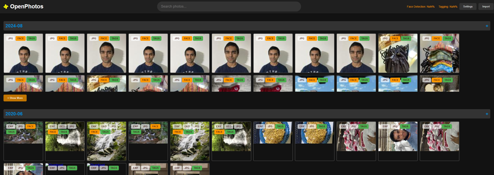
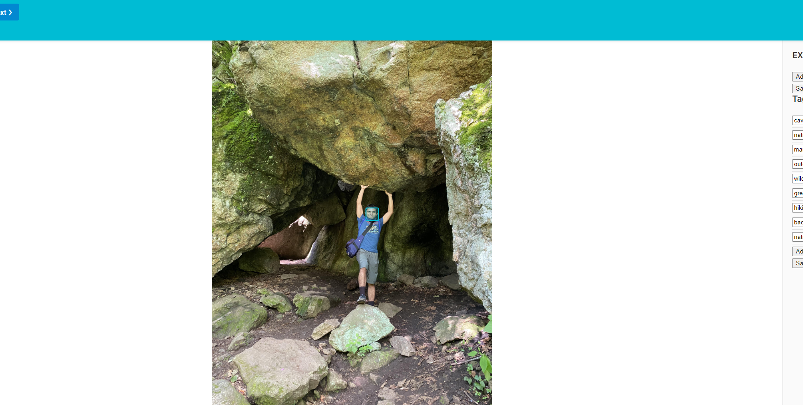
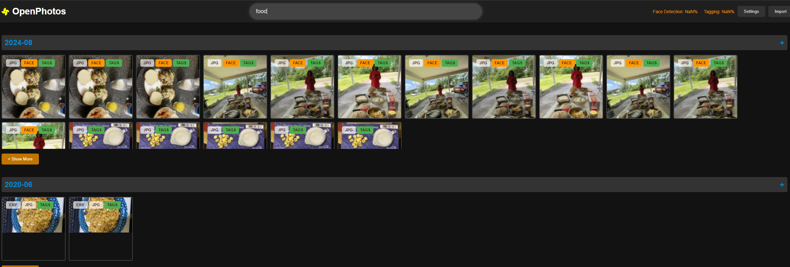
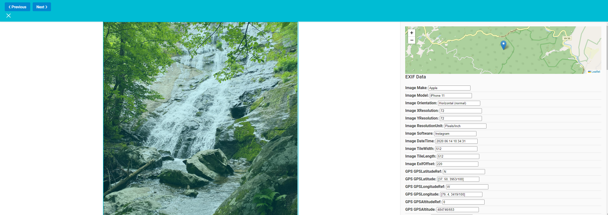

# OpenPhotos: A Locally Hosted Alternative to Google Photos

  

**OpenPhotos** is an open-source, locally hosted alternative to Google Photos. It features robust facial recognition, AI-powered search, image tagging, and more, offering you complete control over your photo library. OpenPhotos is designed for those who prioritize privacy, flexibility, and high-performance photo management without relying on cloud services.

**Disclaimer:** This is a very early version of the product. So it's going to be really buggy.

  


## Features

  

-  **Facial Recognition**: Detect and identify faces in your photo collection using advanced machine learning models.



-  **AI-Powered Search using Ollama**: Search your images with AI-generated tags and classifications for more accurate and relevant results.



-  **Image Tagging**: Automatically tag your images based on content, location, and other metadata.



-  **EXIF Data Management**: View and edit EXIF data directly from the interface.

-  **Map Integration**: View your photos on a map based on their geolocation data.

-  **Fully Local**: All data processing happens on your local machine, ensuring your privacy.

  

## Getting Started

  

### Prerequisites

  

Before you start, ensure you have the following software installed on your machine:

  

-  **Python 3.8+**

-  **Pip** (Python package installer)

-  **Git** (to clone the repository)

-  **SQLite** (comes with python)

-  **Node.js and npm** (for frontend dependencies)

-  **Ollama Server** (for AI-related functionalities)

  

### Step 1: Clone the Repository

  

First, clone the OpenPhotos repository to your local machine:

  

```

git clone https://github.com/yourusername/OpenPhotos.git

cd OpenPhotos

```

  

### Step 2: Install Python Dependencies

  

Create a virtual environment and install the necessary Python packages:

  

```

python3 -m venv venv

source venv/bin/activate # On Windows use `venv\Scripts\activate`

pip install -r requirements.txt

```

  

### Step 3: Set Up Ollama Server

  

Ollama Server is required for AI search and image tagging functionalities. Follow these steps to install and configure it:

  

1.  **Download and Install Ollama Server:**

- Visit the [Ollama Server website](https://ollama.com) and follow the installation instructions for your operating system.

2.  **Start Ollama Server:**

- Once installed, start the server:

```

ollama serve

```

- Ensure the server is running and accessible. By default, it should be available at `http://localhost:5000`.

  

3.  **Integrate Ollama with OpenPhotos:**

- Configure the environment variables to point to your Ollama Server instance by adding the following line to your `.env` file in the project root:

  

```

OLLAMA_SERVER_URL=http://localhost:5000

```

  

### Step 4: Configure the Application

  

Before running the application, configure your settings:

  

1.  **Set the Image Folder Path:**

- Create a `.env` file in the project root and set the path to your image folder:

  

```

IMAGE_FOLDER=/path/to/your/images

```

  

2.  **Database Initialization:**

- The database is automatically initialized when you first run the application.

  

### Step 5: Run the Application

  

Start the application server:

  

```bash

python  app.py

```

  

Visit `http://localhost:5000` in your web browser to start managing your photos with OpenPhotos.

  

### Step 6: Frontend Dependencies

  

Install and build the frontend dependencies:

  

```bash

npm  install

npm  run  build

```

  

This will build the frontend assets and make them available for the Flask server.

  

### Step 7: Additional Features

  

-  **Face Detection and AI Search:**

- Face detection and AI search functionalities are integrated into the application. You can toggle these features via the settings in the user interface.

  

-  **Debugging and Logs:**

- The application logs detailed debugging information to help you troubleshoot any issues. Logs can be found in the `logs` directory.

  

## Contributing

  

We welcome contributions from the community! 

  

## License

  

OpenPhotos is licensed under the MIT License.
  

## Acknowledgments

  

- Special thanks to the developers of Ollama, DeepFace, and the contributors to the open-source libraries used in this project.

  

## Support

  

If you encounter any issues or have questions, please open an issue on the GitHub repository or contact the maintainers directly.

  

---

  

Thank you for using OpenPhotos. Enjoy complete control over your photo library with privacy and powerful features at your fingertips.